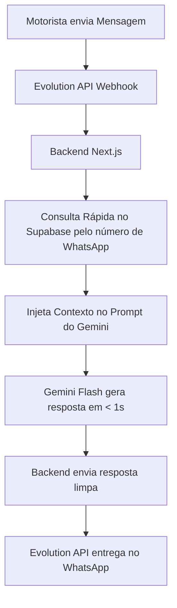

# Plano de Integração: Assistente Inteligente WhatsApp (Gemini Flash + Supabase)

Este documento estabelece o plano arquitetural, de design de interação e de segurança para transformar o bot de WhatsApp atual (baseado em fluxos rígidos de menu) em um **Assistente Inteligente Conversacional** de alta performance, utilizando a API do **Gemini Flash** integrado à base de dados do **Supabase**.

---

## 1. Diretrizes de Design e Tom de Voz (Regras de Ouro)

Para garantir uma comunicação eficiente e corporativa com os motoristas e administradores, a IA seguirá estritamente as regras abaixo:

*   **Tom de Voz:** Extremamente profissional, sério, respeitoso e direto ao ponto.
*   **Proibição Absoluta de Adornos:** **NUNCA** utilizar emojis, figurinhas, stickers, exclamações excessivas ou formatações de texto infantis.
*   **Clareza Máxima:** Apresentar dados de forma limpa, usando quebras de linha e texto estruturado simples.

---

## 2. Arquitetura da Camada de Contexto (Context Layer)

O bot não operará no escuro. A cada mensagem recebida, o backend injetará contexto em tempo real antes de enviar o payload para o Gemini Flash.

### O que compõe o Bloco de Contexto (Injetado em Tempo Real):
1.  **Dados do Motorista:** Nome completo, ID e nível de acesso (Motorista ou Administrador).
2.  **Dados do Veículo:** Caminhão designado atualmente (Placa e Modelo).
3.  **Último KM Registrado:** Quilometragem mais recente salva no banco de dados.
4.  **Histórico Recente:** Últimas 10 a 15 mensagens trocadas para manter a linha de raciocínio.

---

## 3. Fluxo de Confirmação Segura (Double Check)

Para evitar erros acidentais no banco de dados, a IA seguirá um fluxo de confirmação obrigatório antes de salvar qualquer informação sensível (como abastecimento e quilometragem).

### Exemplo Prático de Diálogo de Abastecimento:
> **Motorista:** "botei 100 litros de diesel a 6 reais o litro"
>
> **IA:** "Confirme as informações abaixo para que eu possa realizar o registro:
>
> Combustível: Diesel
> Quantidade: 100 litros
> Valor Total: R$ 600,00 (R$ 6,00/L)
>
> Responda com SIM para confirmar ou informe o que precisa ser corrigido."
>
> **Motorista:** "Sim"
>
> **IA:** "Registro de abastecimento concluído com sucesso. Por favor, envie a foto do cupom fiscal para finalizar."

---

## 4. Tratamento Inteligente de Exceções (Ex: Falta de Comprovante)

Ao contrário dos bots de menu rígido que travam o usuário na ausência de um arquivo, a IA gerenciará a falta de comprovantes de maneira humana e registrará justificativas para auditoria dos gestores.

### Caso o motorista não possua a foto do cupom:
1.  **Identificação:** O motorista informa que não tem a foto (*"não tirei foto"*, *"perdi o cupom"*).
2.  **Captura da Justificativa:** A IA solicita educadamente o motivo e captura a resposta.
3.  **Registro no Supabase:** O abastecimento é salvo com `status = 'pendente_comprovante'` e a coluna `justificativa` é preenchida com a explicação textual fornecida pelo motorista.
4.  **Alerta para o Painel:** O administrador visualiza o registro marcado com alerta no painel administrativo e a justificativa exata.

---

## 5. Ferramentas da IA (Function Calling)

A IA não tem permissão de escrita direta no banco de dados. Ela solicita ao nosso Backend a execução de funções pré-definidas através de **Function Calling**.

### Lista de Ações Mapeadas:

| Nome da Ferramenta | Parâmetros | Descrição | Quem pode usar |
|---|---|---|---|
| `registrar_km` | `placa` (string), `km` (número) | Registra a quilometragem atual do caminhão. | Motoristas e Admins |
| `registrar_abastecimento` | `placa` (string), `litros` (número), `valor_total` (número), `tipo_combustivel` (string), `justificativa` (string, opcional) | Registra um novo abastecimento. | Motoristas e Admins |
| `solicitar_foto` | Nenhum | Solicita que a Evolution API aguarde a recepção de uma mídia (imagem) do motorista. | Motoristas e Admins |
| `desativar_motorista` | `motorista_id` (string ou número) | Desativa/demite um motorista no sistema. | **Apenas Administradores** |

---

## 6. Camada de Segurança e Autorização

O Backend atuará como um "porteiro" inspecionando o número de telefone de quem envia a mensagem:

*   **Validação de Nível:**
    *   Se o remetente for um **Motorista**, o Backend **não** expõe à IA ferramentas administrativas como `desativar_motorista`. A IA sequer saberá que essa função existe no contexto daquela conversa.
    *   Se o remetente for um **Administrador**, a IA terá acesso completo às ferramentas de gestão da frota.
*   **Sanitização de Entrada:** O Backend validará os parâmetros (por exemplo, impedindo valores negativos de KM ou litros) antes de executar qualquer query no banco de dados do Supabase.

---

## 7. Próximos Passos de Implementação

1.  **Credenciais:** Inserir a chave `GEMINI_API_KEY` (gratuita ou paga) no arquivo `.env.local`.
2.  **Esquemas das Funções:** Programar os arquivos JSON de declaração de ferramentas do Gemini no backend Next.js.
3.  **Endpoint do Webhook:** Criar a rota no backend que intercepta as mensagens da Evolution API, busca o motorista no Supabase, monta o prompt de contexto e envia para o Gemini Flash.
4.  **Tratamento das Ações:** Implementar os handlers que executam a escrita no banco de dados quando o Gemini solicita uma ação (como salvar KM ou abastecimento).
